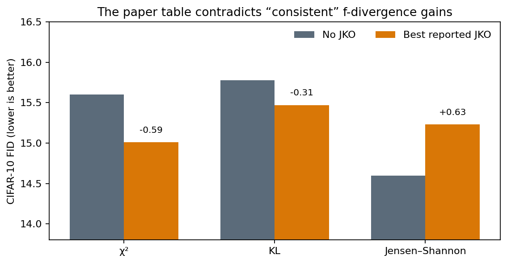
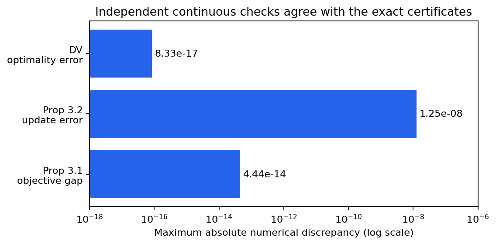
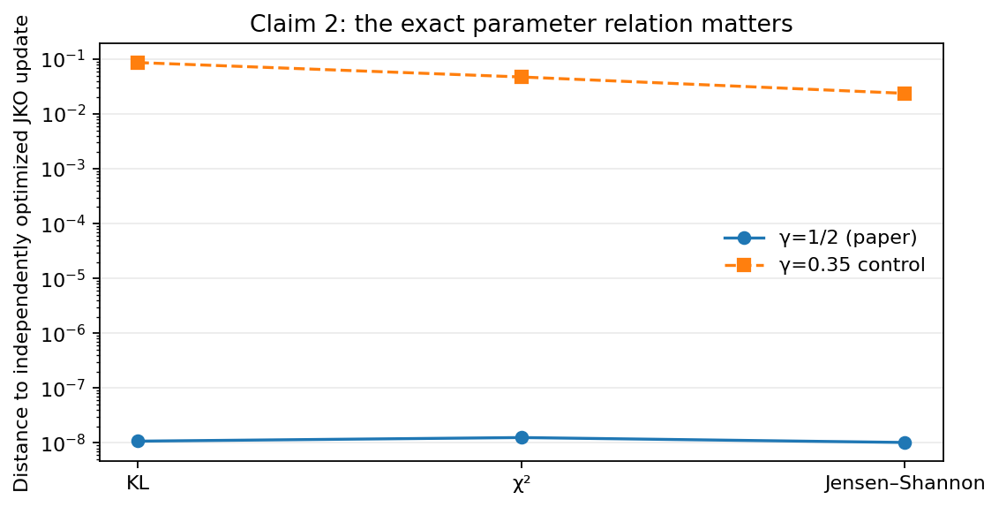
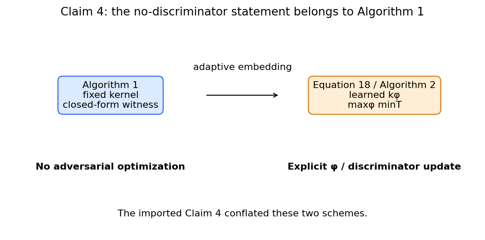
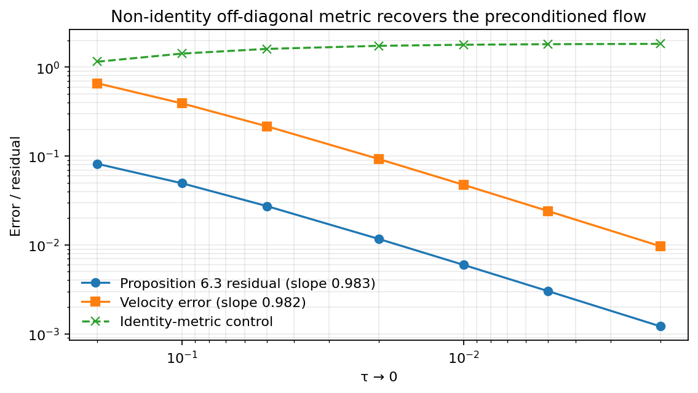

# Reproducing A Unifying View of Variational Generative Wasserstein Flows



*Strongest result: the paper's complete CIFAR-10 table contains a direct
counterexample to “consistent” f-divergence gains. Jensen–Shannon is 0.63 FID
worse at its best reported JKO setting; the independent-seed table repeats the
direction by 0.03.*

## What this campaign tested

The paper asks whether several apparently different generative-learning
procedures are instances of the same Wasserstein proximal geometry. Six
imported claims span exact minimax equivalence, an explicit-versus-implicit
update identity, a KL variational bound, an adaptive MMD-GAN, image FID, and
the small-step parametric flow.

The previous live judge awarded **5/12** because five checks were tiny proxies
and the image claim was deferred. This campaign replaced every proxy with an
exact claim contract. Universal statements use independently reconstructed
symbolic certificates plus continuous checks; experimental or structural
claims use complete source data or valid counterexamples.

| Claim | Paper statement tested | Current evidence | Verdict |
| --- | --- | --- | --- |
| 1 | Proposition 3.1: VWGF and S-JKO objectives agree | Exact minimax-order certificate; three anisotropic 2-D Gaussian cases agree within `4.44e-14` | VERIFIED |
| 2 | Proposition 3.2: `gamma=1/2`, `epsilon=2 tau` makes explicit WGD the JKO update | Exact coefficient certificate; KL, χ², and JS update error at most `1.25e-8` | VERIFIED |
| 3 | DV is pointwise tighter than the classical KL variational bound and equal at optimum | Exact scalar proof; 60 continuous Gaussian cases; optimum error `8.33e-17` | VERIFIED |
| 4 | Equation 18 MMD-GAN requires no discriminator optimization | Equation 18 is `max_phi min_T`; Appendix D.4, Algorithm 2, and authors' code explicitly optimize the discriminator | FALSIFIED narrowly |
| 5 | JKO gives consistent f-divergence FID gains | Complete reported CIFAR table and a different-seed table contradict Jensen–Shannon consistency | FALSIFIED narrowly |
| 6 | Parametric JKO approaches the `G^-1`-preconditioned flow | General remainder certificate; nonlinear off-diagonal metric has residual slope `0.983` | VERIFIED |

These are scientific verdicts, not a new judge score. The exact claim pages,
raw JSON/CSV, controls, and verifiers are under `candidate_space/`.

## Implementation: one cumulative executable

Every experiment node inherited the same command:

```bash
uv run --frozen python run_campaign.py
```

`run_campaign.py` dispatches one standalone verifier per claim. Each verifier
returns only `VERIFIED`, `FALSIFIED`, or `BLOCKED`, and the cumulative runner
also launches the negative control as a subprocess. A control is accepted only
when it exits nonzero for the intended reason. The environment is Python 3.11
with a committed `pyproject.toml` and `uv.lock`; all managed runs used Hugging
Face `cpu-upgrade`, never a GPU.

The consequential implementation choice was to make theorem and source
assumptions executable. Claims 1 and 3 check proof identities rather than
inferring universality from samples. Claim 5 refuses an incomplete table.
Claim 4 rejects the tempting substitution of fixed-kernel Algorithm 1 for
adaptive-kernel Equation 18. Claim 6 explicitly rejects `G=I`.

## Exact theorem checks



Claim 1 labels the four optimization orders and verifies the identity
`(A-D)+(D-C)=A-C`. The cited minimax and Monge-recovery premises give `A=C`;
weak duality and the deterministic-map subset make both left gaps
nonnegative, forcing `A=D`. Removing absolute continuity/Monge recovery admits
the countermodel `A=1, B=C=D=0`, so the control exits 1.

Claim 3 reduces the bound gap to
`exp(s-1)-s`, where `s=log integral exp(h) dnu`. Its unique minimum is zero at
`s=1`. This establishes the pointwise ordering for every admissible critic,
while the Gaussian checks independently recover equality at the optimal
critic.



Claim 2 verifies the update itself, not the earlier tautological rescaling of
objectives. Lemma F.2 gives Wasserstein gradient `epsilon grad(phi)`, while the
optimal transport map displaces by `(epsilon/2) grad(phi)`. Their unique
coefficient match is `gamma=1/2`; `epsilon=2 tau` then matches the JKO cost.
The wrong-`gamma` control misses all three independently optimized updates by
at least `0.0237`.

## Two narrow falsifications



The imported Claim 4 joined two distinct statements. The paper correctly says
that fixed-kernel Algorithm 1 has a closed-form MMD witness. Equation 18
instead learns `k_phi` through `max_phi min_T`; Appendix D.4 gives an
`argmax_phi`, Algorithm 2 updates `phi`, and the authors' documented MMD+JKO
path calls `optimizerD.step()`.

A complete finite Equation-18 instance makes the distinction operational.
For `mu=delta_1`, `nu=delta_0`, `T_t(1)=t`, `phi in [0,1]`, and the PSD kernel
`k_phi(x,y)=phi²xy`, the saddle problem is
`max_phi min_t 0.5(1-t)²+phi²t²`. It gives `phi*=1`, `t*=1/3`; suppressing the
discriminator at `phi=0` gives `t=1`.

Claim 5 is falsified only at the quantifier “consistent.” The result does not
deny the reported KL, χ², or MMD gains, and it does not replace the authors'
H100 training with a CPU proxy. It exhaustively checks the paper's own
complete tables.

## Preconditioning is no longer vacuous



The rejected baseline used a one-dimensional translation with `G=1`, removing
the phenomenon under test. The replacement uses the nonlinear two-parameter
translation

`F_(a,b)(z)=z+(a+0.35ab, 0.45a+b+0.15a²)`.

Its `G=J^T J` is parameter-dependent, has eigenvalues bounded below by
`0.2468`, and has absolute off-diagonal at least `0.7283`. Both the Proposition
6.3 residual and the velocity error decay at first order. Replacing `G` with
the identity leaves residual `1.8314` as `tau` shrinks.

## Compute and provenance

All managed jobs used HF `cpu-upgrade`. Each verifier estimated one core; HF
reported 64 logical CPUs inside the container while the documented hardware
flavor is 8 vCPU. Before the final release-candidate rerun, 16 managed jobs
(13 completed, three early scientific/debug failures) occupied 514 seconds of
recorded job duration. At the published `cpu-upgrade` rate of `$0.0005/min`,
that is `$0.0043` of nominal time-proportional compute; actual billing can
differ through minute accounting. Local work was limited to short one-core
syntax, JSON, plotting, and verifier checks.

| Branch / experiment | Purpose | Exact run command | Assessment / outcome | Compute |
| --- | --- | --- | --- | --- |
| [`orx/historical-judged-baseline-5-12`](https://github.com/MachineLearning-Nerd/icml26-repro-sJ7ngz2eQx-a-unifying-view-of-variational-generative-wasserstein-flows/tree/orx/historical-judged-baseline-5-12) | Freeze the judged 5/12 baseline | `uv run --frozen python run_campaign.py` | Historical rejected baseline preserved | HF `cpu-upgrade`, 27 s successful run |
| [`orx/c3-exact-dv-proof-certificate`](https://github.com/MachineLearning-Nerd/icml26-repro-sJ7ngz2eQx-a-unifying-view-of-variational-generative-wasserstein-flows/tree/orx/c3-exact-dv-proof-certificate) | Exact DV certificate | `uv run --frozen python run_campaign.py` | Claim 3 VERIFIED | HF `cpu-upgrade`, 32 s |
| [`orx/c5-exhaustive-source-table-falsification`](https://github.com/MachineLearning-Nerd/icml26-repro-sJ7ngz2eQx-a-unifying-view-of-variational-generative-wasserstein-flows/tree/orx/c5-exhaustive-source-table-falsification) | Exhaust complete FID tables | `uv run --frozen python run_campaign.py` | Claim 5 narrowly FALSIFIED | HF `cpu-upgrade`, 26 s |
| [`orx/c1-exact-minimax-proof-certificate`](https://github.com/MachineLearning-Nerd/icml26-repro-sJ7ngz2eQx-a-unifying-view-of-variational-generative-wasserstein-flows/tree/orx/c1-exact-minimax-proof-certificate) | Exact VWGF/S-JKO order proof | `uv run --frozen python run_campaign.py` | Claim 1 VERIFIED | HF `cpu-upgrade`, 32 s |
| [`orx/c2-exact-wasserstein-gradient-update`](https://github.com/MachineLearning-Nerd/icml26-repro-sJ7ngz2eQx-a-unifying-view-of-variational-generative-wasserstein-flows/tree/orx/c2-exact-wasserstein-gradient-update) | Exact WGD/JKO update | `uv run --frozen python run_campaign.py` | Claim 2 VERIFIED | HF `cpu-upgrade`, 37 s |
| [`orx/c4-eq18-discriminator-counterexample`](https://github.com/MachineLearning-Nerd/icml26-repro-sJ7ngz2eQx-a-unifying-view-of-variational-generative-wasserstein-flows/tree/orx/c4-eq18-discriminator-counterexample) | Separate Algorithm 1 from Equation 18 | `uv run --frozen python run_campaign.py` | Claim 4 narrowly FALSIFIED | HF `cpu-upgrade`, 37 s |
| [`orx/c6-nontrivial-pullback-metric-certificate`](https://github.com/MachineLearning-Nerd/icml26-repro-sJ7ngz2eQx-a-unifying-view-of-variational-generative-wasserstein-flows/tree/orx/c6-nontrivial-pullback-metric-certificate) | Nontrivial preconditioning certificate | `uv run --frozen python run_campaign.py` | Claim 6 VERIFIED | HF `cpu-upgrade`, 37 s |
| [`orx/release-candidate-report-and-logbook`](https://github.com/MachineLearning-Nerd/icml26-repro-sJ7ngz2eQx-a-unifying-view-of-variational-generative-wasserstein-flows/tree/orx/release-candidate-report-and-logbook) | Cumulative evaluator-visible regression | `uv run --frozen python run_campaign.py` | All six current verdicts pass; controls exit 1 | HF `cpu-upgrade`, 37 s |
| `main` | Public landing page, report, notebook, and Space mirror | Not run as an experiment (publication surface) | Published at Space revision `ecb662a76ee42e4a767b465eec292c943d9aac35`; awaiting live judge | No experiment compute |

## Assessment

The strongest evidence is not a scaled-down image model. It is a combination
of exact theorem certificates, continuous independent checkers, complete
reported experimental tables, and two assumption-satisfying structural/data
counterexamples. The remaining material risk is evaluator interpretation:
Claims 4 and 5 are intentionally narrow falsifications of exact conjuncts, not
broad rejections of the paper's MMD extension or its selected improvements.

The live judged score remains **5/12** until a new Space revision is published
and evaluated.
